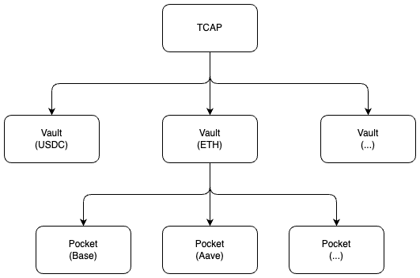

# Documentation

The auto-generated documentation from the natspec comments in the contracts can be found [here](./autogen/src/SUMMARY.md).

---

The TCAP token is an overcollateralized ERC20 token that aims to be pegged to the market cap of the crypto market. Users can mint TCAP by depositing ERC20 tokens into vaults as collateral. When collateral is deposited into a vault, the user can pick a "pocket" to deposit the collateral into.

A pocket manages user assets and isolates them from other deposits. A base pocket simply stores the collateral and does not allow for any lending for example. The Aave pocket is a more complex pocket that lends the deposited collateral on Aave allowing user's capital to be used more efficiently. This mechanism allows a user to chose what level of additional risk they want to take on, as well as isolate their collateral from other deposits.

## Liquidations

Should a user's health factor drop below the liquidation threshold the user's collateral can be liquidated. Liquidators can buy TCAP tokens on the open market and call the liquidate function. The liquidation process burns the TCAP tokens and sends the underlying collateral (liquidation reward) back to the liquidator. By default only a portion of a user's position can be liquidated which pushes the user's health factor back above the liquidation threshold.

The liquidation mechanism is based on the V1 version of the TCAP token. The calculation of the liquidation reward and derivation of the formula can be found [here](https://medium.com/@voithjm1/tokenomics-of-tcap-ce9da45e1be9). A minimum and maximum health factor is enforced after the liquidation. The minimum health factor is enforced after the liquidation to ensure that the user should not be able to be liquidated again immediately after a liquidation. The maximum health factor is enforced to ensure the user does not suffer from a larger than necessary liquidation reward, as the more TCAP tokens are liquidated by the liquidator, the more profitable the liquidation becomes and the more of the underlying collateral the user loses. In cases where the user cannot be liquidated in a way that keeps their health factor between the minimum and maximum health factor, the entire position can be liquidated to mitigate the risk of bad debt.

## Collateral Token Integration Checklist

## Description

Like other contracts of Cryptex before, TCAPv2 too is planned to be under control of Community Governance (DAO). This includes the creation of additional Vaults, of which there'll likely be an increasing amount in order to attract liquidity.

To allow the community to verify the Vaults being added, an important aspect is checking whether the token supposed to serve as collateral is properly compatible with the protocol. For this purpose, it's recommendable to provide those who will vote on such proposals a "Token Integration Checklist".

## Recommendation

We provide the following insights regarding the creation of such a checklist based on our review and understanding of the protocol:

- **Token Standards**: This protocol only deals with underlying tokens of ERC-20 compatible standards. There exist other fungible token standards such as ERC-1155, but these are not supported.
- **Double-Entry-Point Tokens**, ie. tokens that share the same tracking of balances but have two separate contract addresses from which this balances can be controlled. Typically protocols that have sweeping functions (for rescuing funds) are vulnerable to these since they bypass checks preventing sweeping of underlying funds. Pocket contracts do not appear to be vulnerable to this and using such tokens as underlying should not cause any issues.
- **Token Error Handling**: ERC-20 Tokens historically handle errors in two possible ways, they either revert on errors or they simply return a `false` boolean as a result. With the fixes applied, this protocol correctly handles both cases thanks to usage of solady SafeTransferLib's `safeTransferFrom()`.
- **ERC-20 Optional Decimals**: Within the ERC-20 standard, the existence of a `decimals()` function is optional. This protocol however requires it to be present (`BaseOracleUSD.assetDecimals`) and constant over its lifetime. Assuming the function is implemented by the token, it should return its value as `uint8` type, if not, the value must be below 255.
- **Tokens with Callbacks**: There exist various standard extensions such as ERC-223, ERC-677, ERC-777, etc., as well as custom ERC-20 compatible token implementations that call the sender, receiver, or both, during a token transfer. Furthermore, such implementations may choose to call before or after the token balances were updated. This is especially dangerous since it may allow re-entering the protocol and exploit incomplete state updates.
- **Deflationary/Inflationary or Rebasing Tokens**: There are tokens (such as Aave's aToken) which increase in balance over time, or decrease in balance over time (various algorithmic stable coins), this may cause accounting issues within smart contracts holding them. Pockets should be resistant to issues related to this since they take account of shares, not the actual underlying balances. Whether an underlying token decreases or increases in balance, it would effectively decrease or increase the locked underlying value behind each share.
- **Tokens with Transfer Fees**: There are tokens which may charge a fee for transfers. This fee could be applied on the value being sent, decreasing the amount reaching the receiver, or it could be applied on the sender's remaining balance. Pocket contracts are currently not equipped to handle either of these cases appropriately, and won't be without significant changes to how deposits and withdrawals are handled.
- **Tokens with strict Allowance Handling**: There exist tokens which error when attempting to change an existing token allowance from one non-zero value to another non-zero value. At the moment this is only relevant for the `AaveV3Pocket` contract which should be able to handle this whether the logic stays as is (unlimited approval once in the constructor)..
- **Extreme Scale Deviations**: There may be tokens which have both (1) very low decimal values and (2) are very valuable, meaning that the balances when dealing with this token could be so small that rounding errors lead to significant differences in monetary value. It should be checked whether tokens fall into such a category and if potentially so, it should be mathematically verified whether rounding errors are within acceptable ranges.
- **Oracle Integration**: For an asset to be used as collateral within this protocol it must have an active [Chainlink Price Feed](https://data.chain.link/feeds). Furthermore, the [AggregatedChainlinkOracle](https://github.com/cryptexfinance/tcapv2.0/blob/7c3050a56e3f1bad1a100f3e506744d0c71a8807/src/oracle/AggregatedChainlinkOracle.sol#L23-L24) contract adjusts the price responses to 18 decimals based on the reported `decimals()` of the feed. As a sanity check it should be both verified that (1) this decimals value indeed is below 18 as expected by the contract and that (2) the reported decimals value truthfully matches the actual prices currently reported by the feed.
